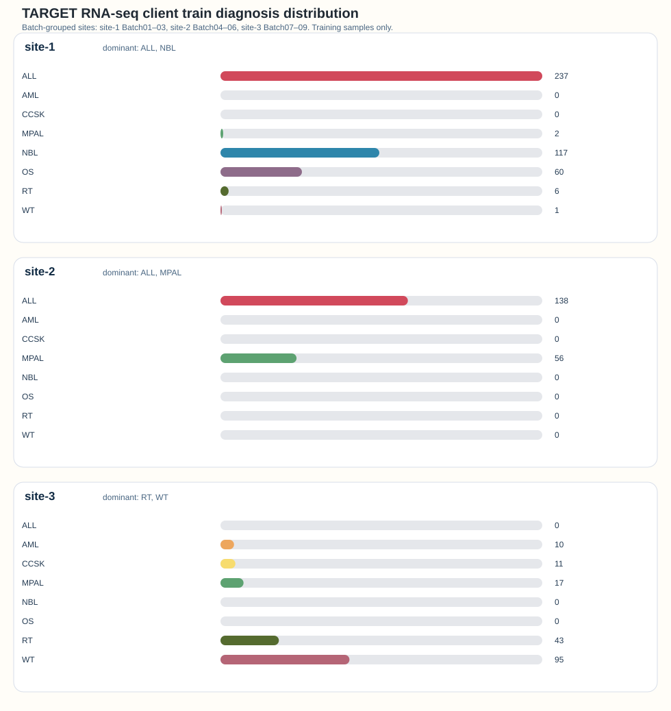
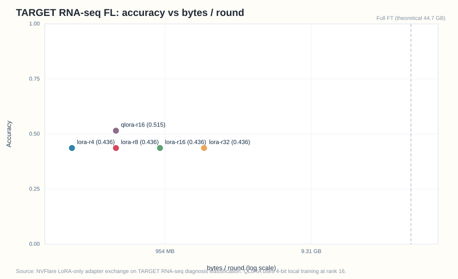
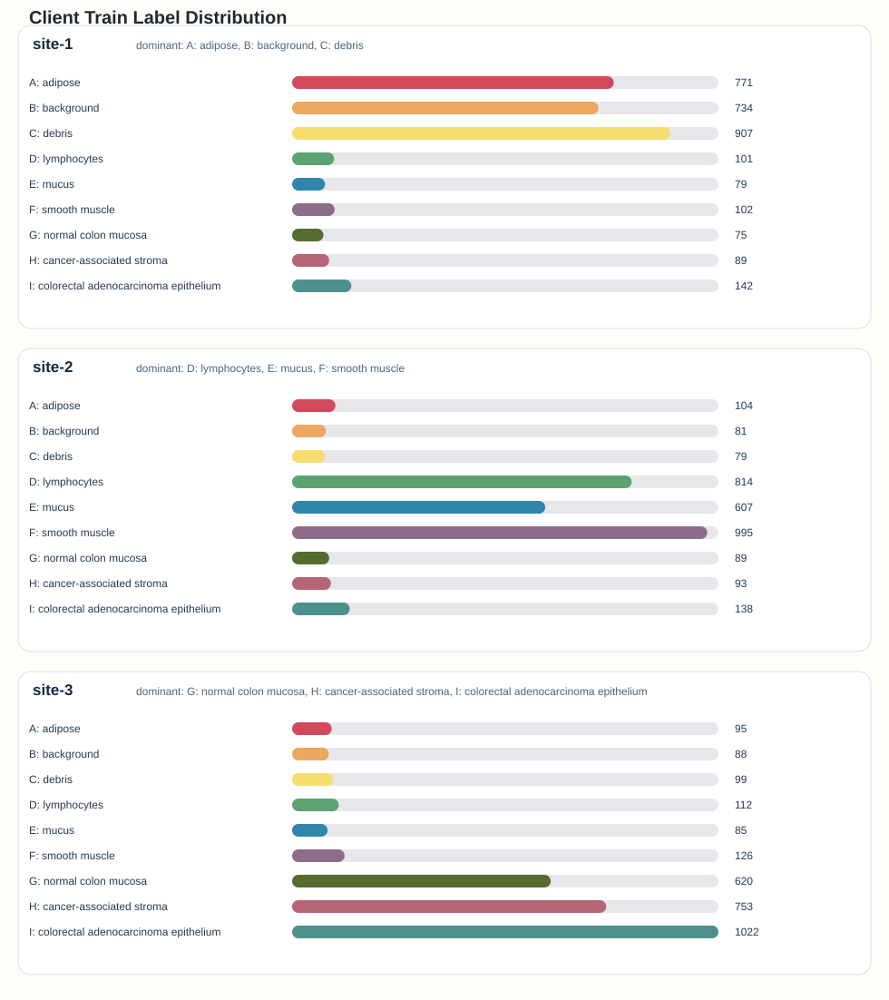

# MedGemma-FL

MedGemma-FL is a research project exploring federated fine-tuning of MedGemma with NVIDIA FLARE and parameter-efficient LoRA/QLoRA training. The intended downstream application is pediatric oncology clinical trial matching.

## Project status

- **This branch (`feat/rnaseq-fl-comm-study`):** TARGET RNA-seq diagnosis classification with 3-site FedAvg LoRA/QLoRA, TMM–CPM text prompts, per-round byte logging, and a communication-vs-accuracy study.
- **`main`:** runnable federated MedGemma fine-tuning on NCT-CRC-HE-100K histopathology (kept below as the original demonstration).
- **Planned next:** class-balanced local SFT with more FL rounds / local epochs on the current non-IID split, then an IID comparison. Gemma Scope 2 interpretability and clinical trial matching are not in the runnable path yet.

We plan to explore Gemma Scope 2 as an interpretability and auditing layer across federated rounds. That work is not part of the current RNA-seq or histopathology baselines.

## Before you start: Hugging Face gated model

Weights for [`google/medgemma-4b-it`](https://huggingface.co/google/medgemma-4b-it) are **gated** on Hugging Face. The repo is visible to everyone, but you must accept the license terms and be allowlisted before file downloads work.

1. Sign in at [huggingface.co](https://huggingface.co) and open [`google/medgemma-4b-it`](https://huggingface.co/google/medgemma-4b-it).
2. On the model page, follow **Access MedGemma on Hugging Face**: review and agree to the **Health AI Developer Foundations** terms so your account is authorized (this is often instant after you accept).
3. If you see an error such as *access is restricted and you are not in the authorized list*, you are not allowlisted yet—repeat the access step on the model page while logged into the correct account, or wait if access is pending.
4. On every machine that downloads or trains the model, use that **same** Hugging Face account: run `hf auth login` or set the `HF_TOKEN` environment variable.

## TARGET RNA-seq communication study

This branch fine-tunes MedGemma **text-only** on TARGET diagnosis (`Dx`) labels. Each sample is a prompt with 200 highly variable genes after edgeR-style **TMM** normalization and **log2(CPM+1)**. Federated clients exchange **LoRA A/B factors only** (`modules_to_save` is empty) so bytes-per-round tracks adapter rank, not the frozen 4B base model.

Raw count/TPM matrices are **not** in this repository (multi-GB; see `.gitignore` `/RNAseq/`). Adapter checkpoints (`*.pt`) are also ignored. Small study logs and plots for the first non-IID run live under `results/baseline_noniid_3r1e/`.

### Local raw data (not uploaded)

Place Washington University TARGET batch matrices and metadata on the machine (not GitHub):

```text
RNAseq/TARGET_meta.txt
RNAseq/WU-TARGET-Batch01-STRANDED_RSEM_gene_count.*.txt
...
RNAseq/WU-TARGET-Batch09-STRANDED_RSEM_gene_count.*.txt
```

`prepare_rnaseq.py` merges **stranded** Batch01–09, then fills missing samples from **unstranded** tables when present. Unlabeled `WU-TARGET_AML_B*` files are skipped. Metadata columns required: `Sample`, `Dx`.

### Preprocess and 3-site split

```bash
python prepare_rnaseq.py --input_dir ./RNAseq --output_dir ./data/rnaseq
```

Default **non-IID** split groups sequencing batches (a site proxy):

| Client | Batches | Role |
|--------|---------|------|
| `site-1` | B01–B03 | local train/val |
| `site-2` | B04–B06 | local train/val |
| `site-3` | B07–B09 | local train/val |
| `eval.json` | held-out patients | global Dx accuracy |

Eight diagnosis classes: ALL, AML, mixed-phenotype acute leukemia (MPAL), neuroblastoma (NBL), osteosarcoma (OS), Wilms tumor (WT), clear cell sarcoma of kidney (CCSK), rhabdoid tumor (RT). `--split_strategy random` writes an IID layout (use a **different** `--output_dir`, e.g. `./data/rnaseq-iid`, so the batch split is not overwritten).



### Baseline experiment (archived)

Protocol for `results/baseline_noniid_3r1e/`:

| Setting | Value |
|---------|--------|
| Clients | 3 |
| FL rounds | 3 |
| Local epochs / round | 1 |
| Class balancing | off |
| LoRA | homogeneous r ∈ {4, 8, 16, 32}, bf16, `--no-quantized` |
| QLoRA | r=16, 4-bit |
| Aggregation | FedAvg, naive A/B averaging |
| Extra PEFT modules | none |
| Global eval | patient-held-out `eval.json` (165 samples) |
| Majority-class floor | ALL 72/165 = **0.4364** |

Global generation accuracy after 3 rounds:

| Run | Bytes / round (approx.) | Global Dx accuracy |
|-----|-------------------------|--------------------|
| LoRA r=4 | 231 MB | 0.4364 |
| LoRA r=8 | 462 MB | 0.4364 |
| LoRA r=16 | 924 MB | 0.4364 |
| LoRA r=32 | 1.85 GB | 0.4364 |
| QLoRA r=16 | 462 MB | **0.5152** |



All LoRA ranks collapsed to the ALL majority baseline on the **global** eval set. Local validation accuracy was higher (~0.50–0.62). Site-3 training data contains **no ALL**, so this snapshot does **not** answer non-IID vs IID vs centralized. Use a new `--comm_log_root` for later runs; do not overwrite `results/baseline_noniid_3r1e/`.

### Reproduce the study

After preprocess and `hf auth login` (or `HF_TOKEN`):

```bash
python run_comm_study.py \
  --experiments lora-r4,lora-r8,lora-r16,lora-r32,qlora-r16 \
  --num_rounds 3 \
  --comm_log_root ./comm_logs \
  --gpu "[0],[1],[2]"
```

Single job (QLoRA example):

```bash
python job.py --task rnaseq --data_dir ./data/rnaseq --num_rounds 3 \
  --global_lora_rank 16 --site_lora_ranks 16,16,16 --quantized \
  --modules_to_save "" --comm_log_dir ./comm_logs/qlora-r16 \
  --experiment_name qlora-r16 --gpu "[0],[1],[2]"
```

Evaluate a saved global adapter on the held-out patients:

```bash
python run_evaluation.py --task rnaseq \
  --eval_file ./data/rnaseq/eval.json \
  --tuned_model_path /tmp/nvflare/simulation/qlora-r16/server/simulate_job/app_server/FL_global_model.pt \
  --finetune_only --max_samples 0
```

Next protocol (does not replace the archived baseline): `--balance_labels`, `--num_rounds 8`, `--num_train_epochs 2`, a new `--comm_log_root` and `--name_suffix` so simulator job names do not collide. IID comparison comes **after** that non-IID rerun.

Step-by-step NVIDIA Brev login, copy, train, eval, and `brev stop`: [docs/brev-rnaseq.md](docs/brev-rnaseq.md).

## Code structure

| File | Role |
|------|------|
| `prepare_rnaseq.py` | Merge TARGET batch counts, TMM–CPM, HVG text prompts, 3-site JSON shards and `eval.json`. |
| `run_comm_study.py` | Homogeneous-rank LoRA/QLoRA job loop, JSONL summary, accuracy-vs-bytes plot. |
| `plot_comm_study.py` | Log-x accuracy vs bytes-per-round SVG. |
| `data_utils.py` | Shared prompt, class-label mappings (tissue and diagnosis), dataset helpers, response parsing, label-distribution SVG. |
| `lora_utils.py` | Shared LoRA key, rank, and truncation helpers used by the client and custom aggregators. |
| `utils.py` | Shared path, memory, CUDA, and JSONL communication-log helpers. |
| `model.py` | MedGemma LoRA wrapper used by the server and clients. The server stores a fixed-rank global LoRA bank and exchanges only adapter weights. |
| `client.py` | NVFlare client entry point. Optional 4-bit QLoRA, optional in-site label oversampling, local SFT, LoRA-only uplink, per-round byte/accuracy JSONL. |
| `custom_aggregators.py` | Server-side max-rank LoRA aggregators for the paper baseline (`naive`) and HLoRA (`hlora`). |
| `job.py` | FedAvg recipe: `--task histopathology` or `rnaseq`, configurable rounds/epochs, ranks, quantization, and `--balance_labels`. |
| `download_data.py` | Downloads and extracts `NCT-CRC-HE-100K.zip` from Zenodo. |
| `prepare_data.py` | Discovers histopathology image files, builds class-skewed site shards by default, and writes `train.json` / `validation.json` for each client. |
| `run_inference.py` | Runs before/after inference on prepared histopathology validation samples. |
| `run_evaluation.py` | Accuracy for CRC-VAL-HE-7K or RNA-seq `eval.json` (`--task rnaseq`). |

## Prerequisites

- **Hugging Face:** allowlisted access and local auth for [`google/medgemma-4b-it`](https://huggingface.co/google/medgemma-4b-it), as described in [Before you start: Hugging Face gated model](#before-you-start-hugging-face-gated-model).
- Python 3.10+
- A CUDA GPU per client that supports `bfloat16` and has at least 40 GB of memory for MedGemma QLoRA.

## 1. Install dependencies

From this directory:

```bash
python3.12 -m venv .venv
source .venv/bin/activate
python -m pip install -U pip
python -m pip install -r requirements.txt
```

On a CUDA VM, prefer `requirements-vm.txt` (do not also install `requirements.txt` in the same env; that can pull a CPU PyTorch wheel).

## Histopathology demonstration (original `main` baseline)

This example adapts Google's centralized [MedGemma fine-tuning notebook](https://github.com/google-health/medgemma/blob/main/notebooks/fine_tune_with_hugging_face.ipynb) into an NVFlare federated workflow. It fine-tunes [MedGemma 4B IT](https://huggingface.co/google/medgemma-4b-it) on the [NCT-CRC-HE-100K](https://zenodo.org/records/1214456) histopathology dataset using Hugging Face `TRL`, [QLoRA](https://arxiv.org/abs/2305.14314), and FedAvg across 3 clients.

The downstream task is multimodal instruction tuning: for each image patch, the model is prompted with a multiple-choice tissue-type question and learns to generate one of nine labels (`adipose`, `background`, `debris`, `lymphocytes`, `mucus`, `smooth muscle`, `normal colon mucosa`, `cancer-associated stroma`, or `colorectal adenocarcinoma epithelium`).

## 2. Download and prepare data

Download and extract the NCT-CRC-HE-100K archive:

```bash
python download_data.py
```

To also download the `CRC-VAL-HE-7K` evaluation dataset used in the notebook's evaluation section:

```bash
python download_data.py --include_eval
```

Then create client splits:

```bash
python prepare_data.py
```

By default, `prepare_data.py` creates 3 client shards with `3333` samples per client and `333` validation samples per client. It now uses a more heterogeneous, class-skewed split by default so the FL setup is less IID and more informative for comparing naive LoRA averaging against HLoRA. With 3 clients, the dominant label groups are:

- `site-1`: `A: adipose`, `B: background`, `C: debris`
- `site-2`: `D: lymphocytes`, `E: mucus`, `F: smooth muscle`
- `site-3`: `G: normal colon mucosa`, `H: cancer-associated stroma`, `I: colorectal adenocarcinoma epithelium`

Output:

```
  site-1: train=3000 -> ./data/site-1/train.json, validation=333 -> ./data/site-1/validation.json
  site-2: train=3000 -> ./data/site-2/train.json, validation=333 -> ./data/site-2/validation.json
  site-3: train=3000 -> ./data/site-3/train.json, validation=333 -> ./data/site-3/validation.json
Wrote label distribution plot to ./data/split_label_distribution.svg
```

`prepare_data.py` also writes a `split_label_distribution.svg` chart so you can quickly inspect how non-IID the client training shards are. The image below is an example of the default 3-client heterogeneous split layout:



Useful flags:

- `--split_strategy random` restores the older IID-style random sharding.
- `--dominant_fraction 0.8` controls how strongly each heterogeneous site is biased toward its dominant label group.
- `--plot_path /path/to/split_label_distribution.svg` overrides where the SVG summary plot is written.
- `--samples_per_client 0` uses the full dataset evenly across all clients.
- `--validation_size_per_client 0` disables per-site validation files.
- `--dataset_dir /path/to/NCT-CRC-HE-100K` points to a different extracted dataset location.

## 3. Run the federated job

With data prepared under `./data/site-{1,2,3}`:

```bash
python job.py
```

Important notes:

- The example always uses LoRA-only FL exchange. The MedGemma base model stays frozen on every client, and FedAvg aggregates only the adapter weights.
- This keeps the full MedGemma checkpoint local to each client and exchanges only the smaller LoRA adapter updates between clients and server.
- The server now keeps a fixed global LoRA rank bank (`--global_lora_rank`, default `16`). By default, the 3-client example uses distinct local ranks `4,8,16`, and the client truncates the incoming global bank to its local rank before training.
- `job.py` defaults to `--lora_aggregation naive`, which matches the HLoRA paper's baseline by averaging LoRA `A` and `B` factors separately inside that fixed global rank bank.
- `python job.py --lora_aggregation hlora` enables HLoRA-style server aggregation: the server reconstructs each client's LoRA update as `B @ A`, averages those reconstructed updates, and projects the result back to the configured global rank bank. Non-LoRA tensors such as `modules_to_save` still use ordinary weighted averaging.
- Both aggregation modes weight clients by the number of local training examples reported by the client (`num_examples`), rather than relying on the first received adapter as a template.
- `job.py` defaults to 3 clients and one GPU per client. If needed, override the GPU mapping with `--gpu "[0],[1],[2]"`.
- The client uses the same prompt format, 4-bit quantization, LoRA config, and multimodal collator pattern as the official notebook.
- When `--lora_aggregation hlora` is used, the default simulator output path changes from `/tmp/nvflare/simulation/medgemma/...` to `/tmp/nvflare/simulation/medgemma-hlora/...`.

Useful flags:

| Option | Description | Example |
|--------|-------------|---------|
| `--workspace` | Override the simulator workspace root. | `python job.py --workspace /data/nvflare/sim` |
| `--n_clients` | Number of federated clients (default: 3). Must match the number of `--gpu` groups and prepared `data/site-*` directories. | `python job.py --n_clients 5` |
| `--num_rounds` | Number of FL rounds. | `python job.py --num_rounds 5` |
| `--max_steps` | Limit local steps per round for quick tests. | `python job.py --max_steps 50` |
| `--learning_rate` | Peak learning rate for local SFT. | `python job.py --learning_rate 1e-4` |
| `--global_lora_rank` | Server-side LoRA bank rank used for aggregation and checkpoint persistence. | `python job.py --global_lora_rank 16` |
| `--site_lora_ranks` | Comma-separated local LoRA ranks per site, e.g. `4,8,16` for three clients. If omitted, the job auto-assigns distinct ranks up to `--global_lora_rank`. | `python job.py --site_lora_ranks 4,8,16` |
| `--lora_aggregation` | LoRA aggregation strategy: `naive` for separate factor averaging in the global bank, `hlora` for reconstructed-update aggregation. | `python job.py --lora_aggregation hlora` |
| `--wandb` | Enable Weights & Biases tracking if `WANDB_API_KEY` is set. | `python job.py --wandb` |

To compare the paper baseline against HLoRA with heterogeneous client ranks, the default 3-client run already uses `site-1=4`, `site-2=8`, and `site-3=16`. You can also set the layout explicitly:

```bash
python job.py --lora_aggregation naive --global_lora_rank 16 --site_lora_ranks 4,8,16
python job.py --lora_aggregation hlora --global_lora_rank 16 --site_lora_ranks 4,8,16
```

In local runs with this heterogeneous-rank layout, HLoRA consistently outperformed the naive factor-averaging baseline on `CRC-VAL-HE-7K`:

| Seed | Naive | HLoRA | Delta |
|------|-------|-------|-------|
| default | `0.8955` (`6430/7180`) | `0.9414` (`6759/7180`) | `+0.0459` |
| alternate | `0.8961` (`6434/7180`) | `0.9366` (`6725/7180`) | `+0.0405` |

Per-site resource logs from H100 runs showed that the impact of local rank depends on how far apart the ranks are. With `4,8,16`, peak memory and round time stayed fairly similar because the shared MedGemma base model and dense `modules_to_save` still dominate the footprint. With larger heterogeneous ranks such as `16,128,256`, the expected rank-dependent memory growth became clearly visible, while round runtime still changed only modestly.

This example is inspired by the HLoRA paper, but it is not an exact reproduction:

- The paper evaluates text tasks in the Plato FL framework, while this example adapts the idea to MedGemma histopathology fine-tuning in NVFlare.
- The paper discusses estimating suitable client ranks during training. This example uses a fixed server-side LoRA bank plus configured client ranks (`4,8,16` by default for 3 clients) rather than adaptive rank selection.
- The HLoRA logic here is implemented through a custom aggregator plus a rank-aware client while keeping the stock FedAvg controller path.
- HLoRA is applied only to the LoRA `A/B` factors. Dense trainable tensors such as `modules_to_save` (`lm_head` and `embed_tokens`) are still aggregated with ordinary weighted averaging.

## 4. Run inference

Compare the base model against the FL-trained global adapter on prepared validation samples.

Base model:

```bash
python run_inference.py --model_path google/medgemma-4b-it
```

Federated fine-tuned global model:

```bash
python run_inference.py --model_path /tmp/nvflare/simulation/medgemma/server/simulate_job/app_server/FL_global_model.pt
```

`run_inference.py` prints the ground-truth tissue label, the parsed model prediction, and the raw generated text for each sample.

Example output before fine-tuning:

```text
--- Sample 1 ---
Ground truth: A: adipose
Prediction:   G: normal colon mucosa
Raw output:   Based on the image, the most likely tissue type is **G: normal colon mucosa**.

Here's why:

*   The image shows a relatively uniform, pink-ish background with some

--- Sample 2 ---
Ground truth: I: colorectal adenocarcinoma epithelium
Prediction:   I: colorectal adenocarcinoma epithelium
Raw output:   Based on the image, the most likely tissue type is **(I) colorectal adenocarcinoma epithelium**.

Here's why:

*   **Epithelial cells:** The image shows a collection of
```

Global model after fine-tuning:

```text
--- Sample 1 ---
Ground truth: A: adipose
Prediction:   A: adipose
Raw output:   A: adipose

--- Sample 2 ---
Ground truth: I: colorectal adenocarcinoma epithelium
Prediction:   I: colorectal adenocarcinoma epithelium
Raw output:   I: colorectal adenocarcinoma epithelium
```

This qualitative shift suggests that fine-tuning is capturing the downstream task well. Before fine-tuning, the base model often answers in a more open-ended, explanatory style and can miss the target class label. After fine-tuning, the global model responds in the compact label format used during training and aligns more directly with the expected tissue-classification output.

## 5. Evaluate accuracy before and after fine-tuning

The MedGemma [fine-tuning notebook](https://github.com/google-health/medgemma/blob/main/notebooks/fine_tune_with_hugging_face.ipynb) evaluates on the separate [CRC-VAL-HE-7K](https://zenodo.org/records/1214456) dataset rather than on the fine-tuning split. This example includes `run_evaluation.py` to mirror that setup and compute accuracy for the base model and the fine-tuned global model on the same evaluation subset.

First, download the evaluation dataset if you have not already:

```bash
python download_data.py --include_eval
```

Then run:

```bash
python run_evaluation.py \
  --dataset_dir ./CRC-VAL-HE-7K \
  --tuned_model_path /tmp/nvflare/simulation/medgemma/server/simulate_job/app_server/FL_global_model.pt
```

By default, `run_evaluation.py`:

- uses `google/medgemma-4b-it` as the before-fine-tuning baseline,
- evaluates on a shuffled subset of **1000 samples**, matching the notebook's default,
- computes accuracy for both models and reports the delta.

> Note, this can take a while to execute but should produce the following result:

**Evaluation Result**
```
Accuracy summary
Base model:       accuracy=0.4130 (413/1000), unparsed=0
Fine-tuned model: accuracy=0.9540 (954/1000), unparsed=0
Delta:            accuracy=+0.5410
```

Useful flags:

- `--max_samples 0` evaluates the full CRC-VAL-HE-7K dataset.
- `--finetune_only` skips the repeated base-model pass and evaluates only the fine-tuned checkpoint.
- `--show_examples 2` prints a couple of qualitative prediction examples per model before the summary.
- `--base_model_path /path/to/model` evaluates a different unfine-tuned checkpoint as the baseline.

## Sources

- Official centralized baseline: [fine_tune_with_hugging_face.ipynb](https://github.com/google-health/medgemma/blob/main/notebooks/fine_tune_with_hugging_face.ipynb)
- MedGemma model: [google/medgemma-4b-it](https://huggingface.co/google/medgemma-4b-it)
- Training data: [NCT-CRC-HE-100K on Zenodo](https://zenodo.org/records/1214456)
- TARGET pediatric RNA-seq batches and diagnosis metadata (local `RNAseq/`; not redistributed in this repo)
- Heterogeneous LoRA reference: [Heterogeneous LoRA for Federated Fine-tuning of On-Device Foundation Models (HetLoRA)](https://research.google/pubs/heterogeneous-lora-for-federated-fine-tuning-of-on-device-foundation-models/)
- HLoRA reference: [HLoRA: Towards Efficient Federated Fine-Tuning of Large Language Models with Heterogeneous LoRA](https://arxiv.org/abs/2503.00813)
